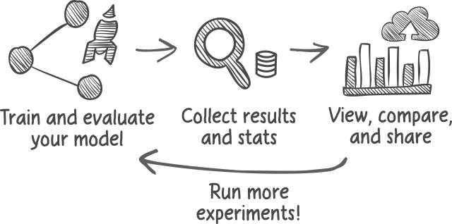
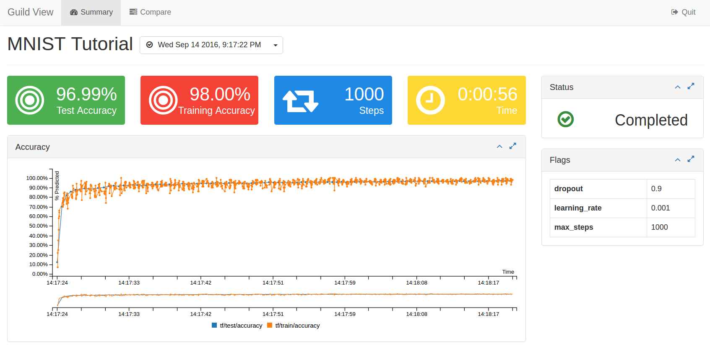

# Guild AI

Guild AI is an open source application and publishing facility that
lets you capture your Deep Learning training and inference details and
share them with others.

Currently Guild supports
the [TensorFlow](https://www.tensorflow.org/)&trade; machine learning
toolset.

Guild is 100% free open source software released under the Apache 2
license.

## Basic workflow

Guild works by wrapping your training scripts with a light-weight
program that monitors its progress and collects additional statistics,
consolidating the data in a single run database. You then view these
results and stats to compare different experiments. When you find
something interesting you can publish results to a Guild server to
share with others.



Here's a simple scenario. First, open a terminal within a Guild
project directory and run the `train` command.

``` shell
$ guild train
```

This executes your standard training script with some additional steps
in the background:

- Guild projects define flags that are automatically added to the
  training command to simply the training operation

- Guild sets up output directories (e.g. those used for logs,
  checkpoints, etc.) for each run to ensure that results are captured
  separately

- Guild montiors training progress in the background, collecting stats
  like loss, accuracy, and other metrics you're interested in

- Guild also collects a full range of system statistics, correlating
  them with training events

While your training is running you can view its progress using the
`view` command. In the same Guild project directory, run:

```
$ guild view
```

This opens a browser for viewing the Guild project. In addition to
viewing the training progress in real time, you can view historical
runs, comparing results as needed.

Views are
different for each project, but generally provide a dashboard of
widgets for visualizing project details.

This is what the MNIST tutorial view looks like:



Here's a short summary of Guild commands:

| Command | |
|---------|-|
| evalute | Evaluate the accuracy of a trained model |
| prepare | Prepare a model for training |
| train   | Trains the model, monitors progress and captures stats |
| view    | Launch a browser based view of the project and its training runs |

For a complete list see [Command Reference](commandref.md).

## Features

### Capture the stats you need to understand your training

Guild runs in the background during training to gather not only
information about your model, but also system statistics like GPU
performance, memory utilization, and disk usage. Together this
information provides a more complete view of how your models perfom
with your training environment. This information can be used to
improve a number of important factors:

- Model accuracy
- Model efficiency
- System (i.e. hardware, operating system, libraries) efficiency
- Trade offs between accuracy and efficiency within an operating
  environment

### Visualize your training progress and results

Guild projects provide an at-a-glance dashboard view of a project,
letting users quickly assess performance. This is helpfule for teams
working on a stable architecture as it lets users focus on the most
important metrics.

### Compare runs across a wide range of criteria, including results from others

Guild provides a flexible comparison view to explore run characeritics
over time. This lets users assess how changes to model architecture,
data, training parameters and even system changes impact performance
and efficiency.

This can be used to track down important improvements (or set backs)
and understand performance/efficiency characteritics, including those
introduced by the system itself.

Guild even lets you compare results from others!

Here are some examples of what you might learn:

- Which learning rate or schedule performs the best for your model and dataset?

- How does your training environment perform relative to others?

- Are there alternative models or architectures that improve latency
  at the expense of accuracy?

### Publish your results for others to learn from

Once you've discovered something that's interesting, you can publish
your run results for others to learn from. In turn you benefit from
the experience of others!

## Next Steps

To start using Guild for your deep learnign project, follow the steps
in our [Getting Started](getting-started.md) guide.
